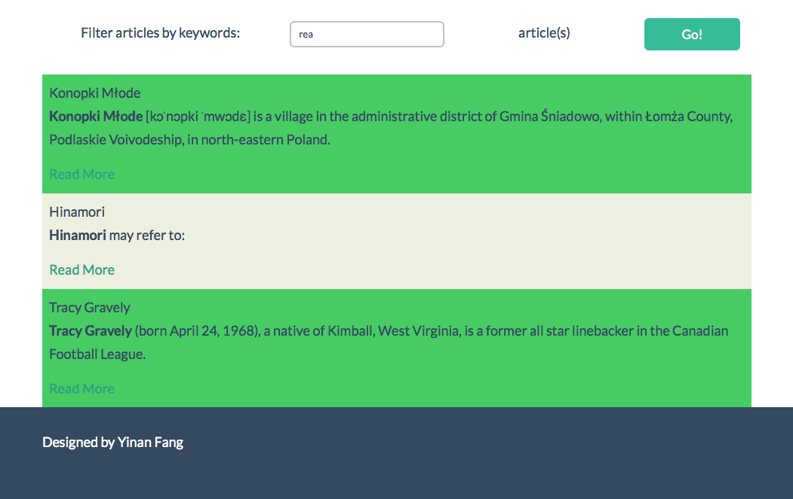

SmashingBoxes_EFTest
====================

A basic Wikipedia article viewer web application that allows a user to viewrandom article extracts.

Requirements:
• Consume wikipedia's restful JSON API

• View random article - 1st paragraph only
• Refresh or select a new random article
• Single-page application
• No page refresh required to update API data
• Completely client side application (should not rely on any server side
system/data source other than wikipedia's API)
Technology Suggestions
• jQuery
• HTML5
• CSS3
• UI Framework (Bootstrap/Foundation/...)
Functionality
Suggestions (Not requirements)
• Choose number of articles displayed
• Usable on mobile and laptop/desktop, IE10+ (Responsive and Cross
Browser)
• Ignore user chatter/talk (check out namespaces in the API)
• Link to main article
• Filter articles based on word list (specifically for explicit content/words) • Limit by user specified category
• Anything else that would make a cool/useful feature
WIKI API url: http://en.wikipedia.org/w/api.php